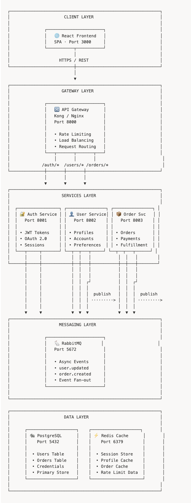
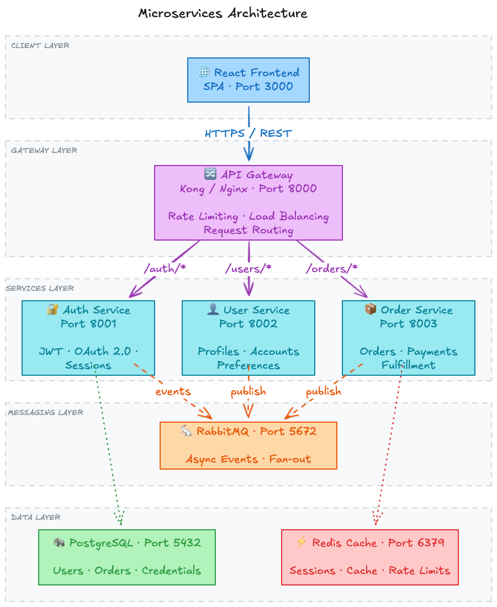
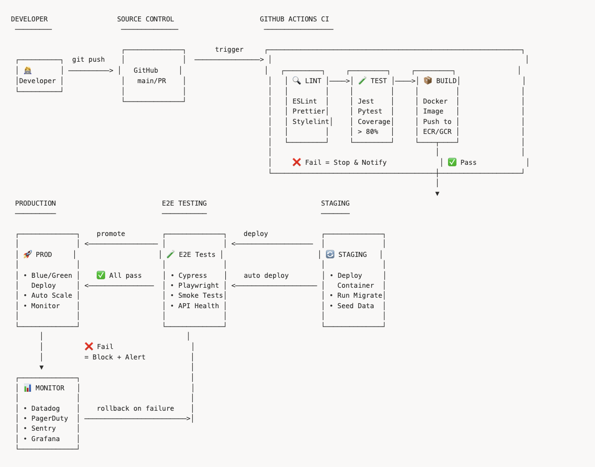
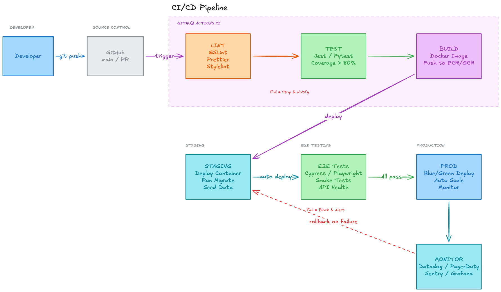
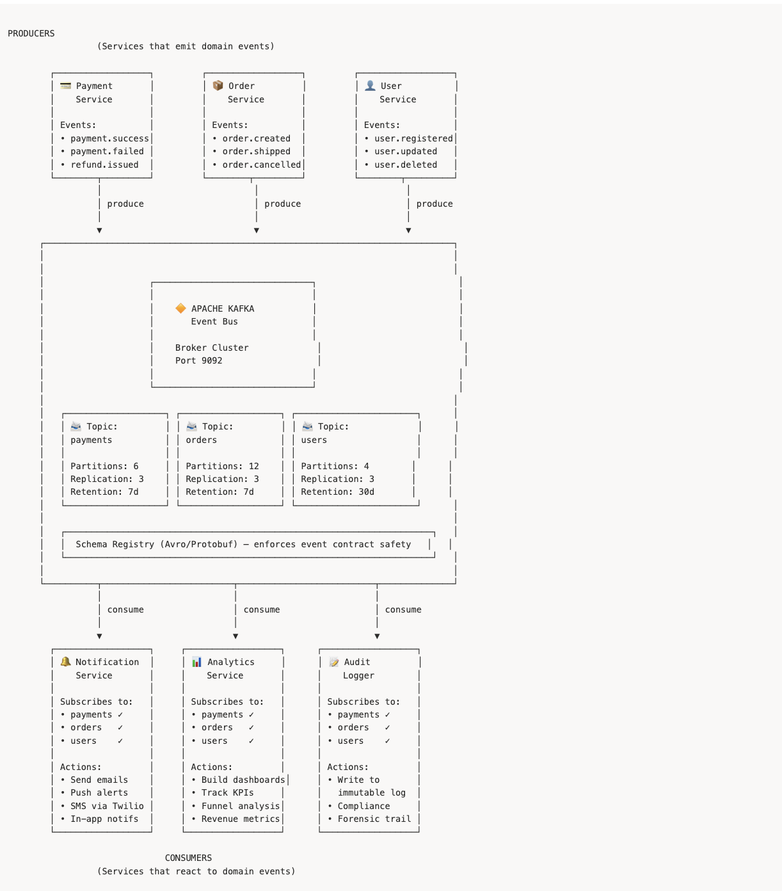
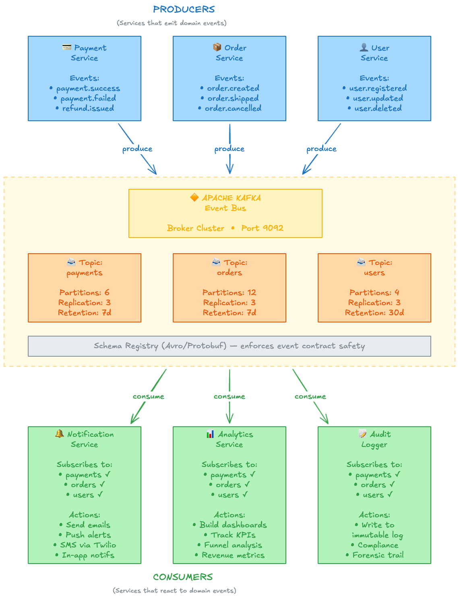
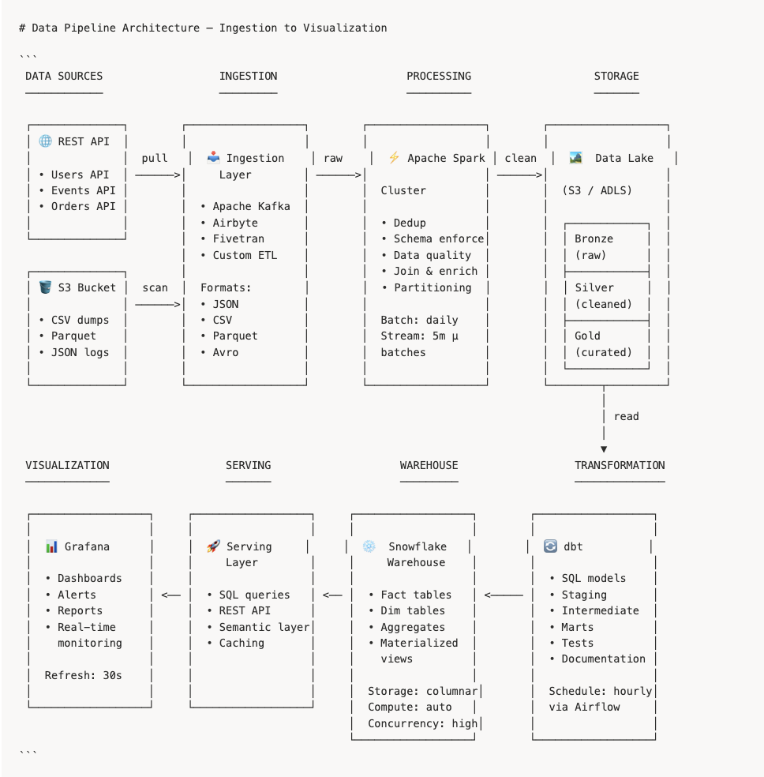
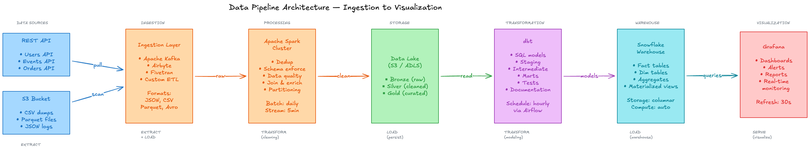

# Excalidraw Toolkit

An AI-powered diagramming toolkit for Claude Code. Say **"diagram this repo"** and watch your codebase turn into an architecture diagram on a live Excalidraw canvas.

```
> diagram this repo

I found 6 components and 5 connections:
  - Next.js Frontend → API Routes (REST)
  - API Routes → Prisma ORM → PostgreSQL (SQL)
  - API Routes → NextAuth (auth) + Stripe API (payments)

Does this look right?

> looks good

[Building diagram on live canvas...]
```

## Install

```bash
npx excalidraw-toolkit init
npx excalidraw-toolkit start
```

Two commands. `init` copies skills to `~/.claude/plugins/` and configures the MCP server. `start` launches the Excalidraw canvas server via Docker and opens your browser.

Restart Claude Code and try: **"diagram this repo"**

Verify setup with:

```bash
npx excalidraw-toolkit doctor
```

<details>
<summary>Alternative: install via Claude Code plugin marketplace</summary>

```bash
/plugin marketplace add edwingao28/excalidraw-skill
/plugin install excalidraw@excalidraw-skill
```

</details>

## What You Get

### Auto-Diagram — Zero-Config Codebase Visualization

Just say **"diagram this repo"**. No description needed.

The auto-diagram skill runs a 6-phase pipeline:
1. **Detect** project type (monorepo, microservices, standard app) and framework (Next.js, Django, Go, Rails, etc.)
2. **Discover** components (frontend, API routes, database, queues, cache, auth, external services)
3. **Map** connections between components (REST, SQL, gRPC, events, imports)
4. **Verify** with you before drawing — presents a summary, asks for confirmation
5. **Choose layout** (vertical flow, horizontal pipeline, hub-and-spoke, or zoned modules)
6. **Generate** the diagram on the live canvas with color-coded components

Works with any language. Context budget prevents blowout on large codebases.

### Agentic Self-Critique

Every diagram goes through an automatic quality check before you see it:

1. **Snapshot** the canvas for rollback safety
2. **Geometric validation** via `query_elements` — detects overlapping shapes, cramped spacing, broken zones
3. **Visual validation** via screenshot — checks arrow labels, text readability, title, centering
4. **Auto-fix** up to 2 rounds. If fixes make things worse, rolls back to the snapshot

You never see a broken diagram. The self-critique loop catches layout issues that would otherwise require manual tweaking.

### Described Diagrams

When you know what you want, describe it:

```
"Draw a microservices architecture with: React frontend, API Gateway,
Auth Service, User Service, Order Service, RabbitMQ, PostgreSQL, Redis"
```

Or trace data flows:

```
"Trace how the auth token flows from login to API request to database query"
```

Or convert from Mermaid:

```
"Create an excalidraw diagram from this mermaid:
graph TD; A[Frontend] -->|REST| B[API]; B -->|SQL| C[Database]"
```

## Examples

Same prompt, two renderers: **Markdown** (Mermaid via `create_from_mermaid`) vs **Excalidraw** (native canvas via `batch_create_elements`).

### Microservices Architecture

| Markdown | Excalidraw |
|:---:|:---:|
|  |  |

### CI/CD Pipeline

| Markdown | Excalidraw |
|:---:|:---:|
|  |  |

### Event-Driven System

| Markdown | Excalidraw |
|:---:|:---:|
|  |  |

### Data Pipeline

| Markdown | Excalidraw |
|:---:|:---:|
|  |  |

## How It Works

Two skills, one toolkit:

| Skill | Triggers On | Does |
|-------|-------------|------|
| **auto-diagram** | "diagram this repo", "visualize the architecture" | Analyzes codebase, discovers components, generates diagram |
| **excalidraw** | "draw a diagram of X", user provides description/sample | Renders user-specified diagrams with precise layout control |

Both skills use MCP tools to draw on a live Excalidraw canvas:

| Tool | Purpose |
|------|---------|
| `batch_create_elements` | Create all shapes + arrows in one call |
| `get_canvas_screenshot` | Visual verification after each step |
| `query_elements` | Geometric validation for self-critique |
| `snapshot_scene` / `restore_snapshot` | Rollback safety during self-critique |
| `export_to_image` | Save as PNG or SVG |
| `export_scene` | Save as editable `.excalidraw` file |
| `export_to_excalidraw_url` | Generate a shareable link |

## Color Palette

Every component type gets a consistent color:

| Component | Background | Stroke |
|-----------|------------|--------|
| Frontend/UI | `#a5d8ff` | `#1971c2` |
| Backend/API | `#d0bfff` | `#7048e8` |
| Database | `#b2f2bb` | `#2f9e44` |
| AI/ML | `#e599f7` | `#9c36b5` |
| Queue/Event | `#fff3bf` | `#fab005` |
| External API | `#ffc9c9` | `#e03131` |
| Storage | `#ffec99` | `#f08c00` |
| Cache | `#ffe8cc` | `#fd7e14` |
| Zone/Group | `#e9ecef` | `#868e96` |

Cloud-specific palettes (AWS, Azure, GCP, Kubernetes) are included in `references/colors.md`.

## CLI Commands

```bash
npx excalidraw-toolkit init        # install skills + configure MCP server
npx excalidraw-toolkit start       # start canvas server (Docker) + open browser
npx excalidraw-toolkit stop        # stop canvas server
npx excalidraw-toolkit update      # re-install (overwrites existing)
npx excalidraw-toolkit uninstall   # remove skills + MCP config
npx excalidraw-toolkit doctor      # check installation health
npx excalidraw-toolkit version     # print version
```

## Compatible MCP Servers

Any Excalidraw MCP server exposing the core tools works. Register under key `"excalidraw"`.

| Package | Tools | Install |
|---------|-------|---------|
| [`mcp-excalidraw-server`](https://github.com/yctimlin/mcp_excalidraw) (default) | 26 | `npx -y mcp-excalidraw-server` |
| [`excalidraw-mcp-server`](https://github.com/debu-sinha/excalidraw-mcp-server) | 16 | `npx -y excalidraw-mcp-server` |

## Requirements

- [Claude Code](https://docs.anthropic.com/en/docs/claude-code) CLI
- Node.js >= 18
- Docker (for canvas server) or [build from source](https://github.com/yctimlin/mcp_excalidraw)
- A browser with the canvas open at http://localhost:3000

## Credits

Created by [@edwingao28](https://github.com/edwingao28) with Claude Code.

## License

MIT
